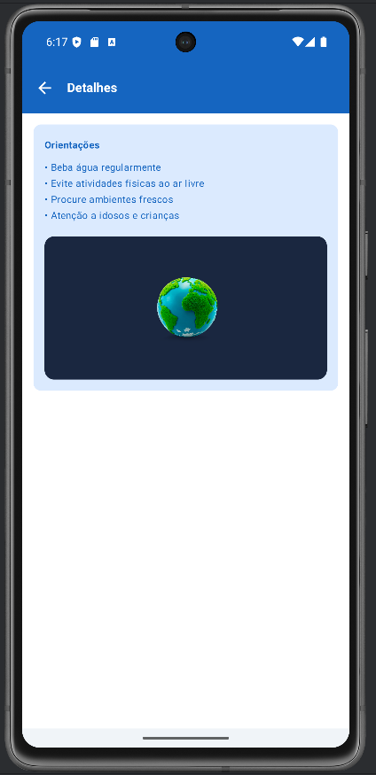

# 🌍 ORBIS — Monitoramento Climático

> Conectando dados ambientais, tecnologia e conscientização para cidades mais resilientes.

---

## 👥 Integrantes

| Nome | RM |
|---|---|
| Anny Pereira | — | 553793
| Giovanna Makida | — | 552852
| Katharine Fernandes | — | 552673

---

## 🎯 Global Solution

A Nova Corrida Espacial propõe o uso de tecnologias espaciais para gerar impacto positivo na sociedade. O ORBIS responde a esse desafio utilizando dados de sensoriamento remoto e APIs de observação da Terra para democratizar o acesso a informações climáticas urbanas.

---

## 📋 Descrição da Solução

O **ORBIS** é uma plataforma de monitoramento climático focada no fenômeno das **ilhas de calor urbanas** — o aumento progressivo da temperatura em áreas urbanas causado pela substituição de vegetação por concreto e asfalto.

A solução integra dados da **API Open-Meteo** para exibir a temperatura do solo em tempo real e apresenta recomendações orientativas ao usuário conforme o nível de calor detectado.

---

## 🛠️ Tecnologias Utilizadas

| Camada | Tecnologia |
|---|---|
| Mobile | Kotlin + Jetpack Compose |
| API climática | Open-Meteo |

---

## 📱 Fluxo de Telas

```
Splash
  └── Onboarding
        └── Busca
              ├── Home
              │     ├── Detalhes
              │     └── Favoritos
              └── Favoritos
```

### Descrição de cada tela

**1. Splash**
Tela de carregamento inicial.

**2. Onboarding**
Apresenta o propósito do app ao usuário. Exibida apenas na primeira abertura. Ao avançar, salva a preferência em SharedPreferences.

**3. Busca**
Permite ao usuário pesquisar uma cidade pelo nome.

**4. Principal**
Exibe a temperatura do solo atual da cidade selecionada, badge de alerta (normal / moderado / intenso), recomendações de saúde e atalho para detalhes.

**5. Detalhes**
Informações adicionais de orientações.

**6. Favoritos**
Lista de cidades salvas pelo usuário.

---

## 🖼️ Prints das Telas

### 1. Splash


### 2. Onboarding


### 3. Busca


### 4. Principal


### 5. Detalhes


### 6. Favoritos
